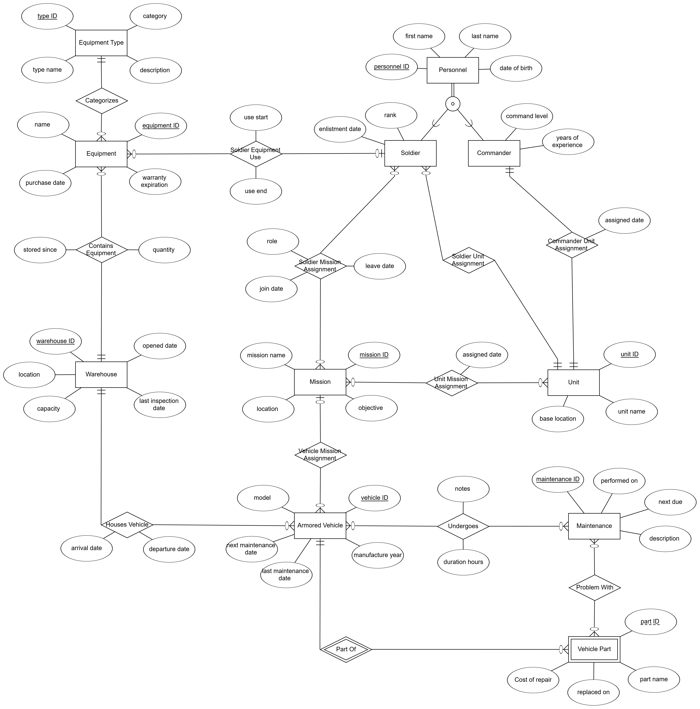

# DBProject_328269121_329114573 

# 🛡️ Armored Warehouse Management System

## 👤 Authors:
- Eliel Monfort - 328269121
- Yehoshua Steinitz - 329114573

---

## 📚 Table of Contents

1. [📘 Introduction](#-introduction)
2. [🗂️ Entities and Attributes](#-entities-and-attributes)
4. [🔗 Relationships](#-relationships)
5. [📈 ERD & DSD Diagrams](#-erd--dsd-diagrams)
6. [🧠 Design Decisions](#-design-decisions)
7. [📥 Data Insertion Methods](#-data-insertion-methods)
8. [💾 Backup and Restore](#-backup-and-restore)

---

## 📘 Introduction

This project is a **Database Management System** for the **Logistics Unit of the Armored Corps**.

The system is designed to manage all aspects related to **military equipment**, **armored vehicles**, **soldiers**, **commanders**, **missions**, and **vehicle maintenance**.

It stores important data and enables efficient tracking of:

- Equipment stored in warehouses  
- Which soldier or unit is using specific equipment  
- Armored vehicles and their maintenance history  
- Soldiers, commanders, and their assigned units  
- Missions and which units and soldiers are involved  

The goal is to build a smart and organized database that supports real military operations and provides accurate, real-time information for decision-making.

---

# 🛡️ Armored Warehouse Management Database

This project describes the database structure for managing armored warehouses, vehicles, missions, personnel, equipment, and maintenance operations.

---

## 🗂️ Entities and Attributes

### 🏢 Warehouse
Represents a storage location for vehicles and equipment.
- `warehouse ID` (PK): Unique warehouse identifier
- `location`: Physical location
- `capacity`: Storage capacity
- `opened date`: Date the warehouse was opened
- `last inspection_date`: Last inspection date

### 🎯 Mission
Represents a military mission.
- `mission ID` (PK): Unique mission identifier
- `mission name`: Name of the mission
- `location`: Mission location
- `objective`: Mission objective

### 🧰 Equipment Type
Defines categories of equipment.
- `type ID` (PK): Unique type identifier
- `type name`: Type name
- `description`: Detailed description
- `category`: General category of the equipment

### 🚛 Armored Vehicle
Represents an armored vehicle.
- `vehicle ID` (PK): Unique vehicle identifier
- `model`: Vehicle model
- `manufacture year`: Year of manufacture
- `last_maintenance date`: Date of last maintenance
- `next_maintenance date`: Planned date for next maintenance

### 🔧 Maintenance
Represents maintenance actions.
- `maintenance ID` (PK): Unique maintenance identifier
- `performed on`: Date maintenance was performed
- `next due`: Date of next scheduled maintenance
- `description`: Description of the maintenance

### 👤 Personnel (Superclass)
Represents a person, either a soldier or a commander.
- `personnel ID` (PK): Unique personnel identifier
- `first name`: First name
- `last name`: Last name
- `date of birth`: Date of birth

### 🧑‍✈️ Commander (inherits from `Personnel`)
Subtype of Personnel – represents a commander.
- `command level`: Command level
- `years of experience`: Years of experience

### 🪖 Soldier (inherits from `Personnel`)
Subtype of Personnel – represents a soldier.
- `rank`: Military rank
- `enlistment date`: Enlistment date

### 🪖 Unit
Represents a military unit.
- `unit ID` (PK): Unique unit identifier
- `unit name`: Unit name
- `base location`: Base location

### ⚙️ Vehicle Part
Represents a part belonging to a specific vehicle (weak entity).
- `part ID` (Partial PK): Part identifier
- `part name`: Part name
- `Cost of repair`: Repair cost
- `replaced on`: Replacement date

### 🔄 Undergoes
Associates maintenance procedures with vehicles.
- `maintenance ID` (PK, FK): Maintenance identifier
- `vehicle ID` (PK, FK): Vehicle identifier
- `notes`: Notes regarding the maintenance
- `duration hours`: Duration in hours

### 🧩 Problem With
Represents parts that had issues during maintenance.
- `maintenance ID` (PK, FK): Maintenance identifier
- `part ID` (PK): Part identifier  
- `vehicle ID` (PK, FK): Vehicle identifier  

### 🎒 Equipment
Represents a piece of equipment.
- `equipment ID` (PK): Unique equipment identifier
- `name`: Equipment name
- `purchase date`: Date of purchase
- `warranty expiration`: Warranty expiration date

### 🪖 Soldier Mission Assignment
Associates soldiers with missions.
- `mission ID` (PK, FK): Mission identifier
- `personnel ID` (PK, FK): Soldier’s personnel ID
- `role`: Role during the mission
- `join date`: Start date
- `leave date`: End date

### 🏹 Unit Mission Assignment
Associates military units with missions.
- `mission ID` (PK, FK): Mission identifier
- `unit ID` (PK, FK): Unit identifier
- `assigned date`: Date assigned to mission

---

## 🔗 Relationships

### Commander Unit Assignment
- **Linked Entities:** Commander ⟷ Unit
- **Type:** One-to-One
- **Explanation:** Each unit is led by one commander, and a commander leads only one unit.

### Soldier Unit Assignment
- **Linked Entities:** Soldier ⟷ Unit
- **Type:** Many-to-One
- **Explanation:** Each soldier belongs to one unit, while a unit can have many soldiers.

### Soldier Mission Assignment
- **Linked Entities:** Soldier ⟷ Mission
- **Type:** Many-to-Many
- **Attributes:** 
- **Explanation:** Soldiers can be assigned to multiple missions, with additional details such as role and dates.

### Unit ⟷ Mission (`Unit_Mission_Assignment`)
- **Linked Entities:**
- **Type:** Many-to-Many with assignment date  
- **Explanation:** Units can participate in multiple missions; each assignment has a specific date.

### 🚚 Vehicle ⟷ Warehouse
- **Linked Entities:**
- **Type:** Many-to-One  
- **Explanation:** Each vehicle is stored in one warehouse, and a warehouse can store many vehicles.

### 🎯 Vehicle ⟷ Mission
- **Linked Entities:**
- **Type:** Optional Many-to-One  
- **Explanation:** A vehicle may be assigned to a mission, but it's not mandatory.

### 🧪 Maintenance ⟷ Vehicle (`Undergoes`)
- **Linked Entities:**
- **Type:** Many-to-Many with attributes  
- **Explanation:** A maintenance operation may involve several vehicles, each with specific notes and duration.

### ⚙️ Maintenance ⟷ Part (`Problem_With`)
- **Linked Entities:**
- **Type:** Many-to-Many  
- **Explanation:** Each maintenance action can report issues with multiple parts in one or more vehicles.

### 📦 Equipment ⟷ Personnel
- **Linked Entities:**
- **Type:** Optional Many-to-One  
- **Explanation:** Equipment may optionally be assigned to a soldier.

### 🏚️ Equipment ⟷ Warehouse
- **Linked Entities:**
- **Type:** Many-to-One  
- **Explanation:** Equipment is stored in a specific warehouse.

### 🧩 Vehicle_Part ⟷ Vehicle
- **Linked Entities:**
- **Type:** Weak Entity Relationship  
- **Explanation:** A part belongs to a specific vehicle and cannot exist independently.

### 🔧 Equipment ⟷ Equipment_Type
- **Linked Entities:**
- **Type:** Many-to-One  
- **Explanation:** Each equipment item belongs to a defined type, such as weapon, communication device, etc.

---

## 📈 ERD & DSD Diagrams

- **ERD Diagram**:

- **DSD Diagram**:

