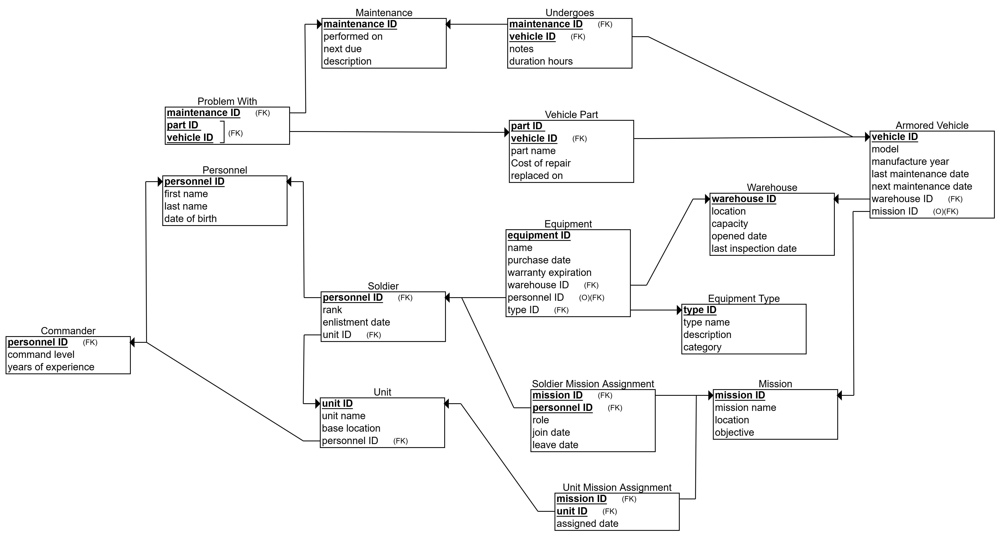

# DBProject_328269121_329114573 

# 🛡️ Armored Warehouse Management System

## 👤 Authors:
- Eliel Monfort - 328269121
- Yehoshua Steinitz - 329114573

## 🎯 Selected Unit:
Logistics Department – Armored Corps

---

## 📚 Table of Contents

1. [📘 Introduction](#-introduction)
2. [🗂️ Entities and Attributes](#-entities-and-attributes)
3. [🔗 Relationships](#-relationships)
4. [📈 ERD & DSD Diagrams](#-erd--dsd-diagrams)
5. [🧠 Design Decisions](#-design-decisions)
6. [📥 Data Insertion Methods](#-data-insertion-methods)
7. [💾 Backup and Restore](#-backup-and-restore)

---

## 📘 Introduction

The **Armored Warehouse Management System** was built to manage logistical data related to military equipment, armored vehicles, personnel, maintenance operations, and missions within the Armored Corps.

### Key Functionalities:
- Track warehouse equipment, stock, and assignments.
- Monitor maintenance history of vehicles and parts.
- Manage military units, missions, soldiers, and commanders.
- Maintain a full historical log of equipment repairs and usage.

---

## 🗂️ Entities and Attributes

### 1. `Warehouse`
- `warehouse_ID` (PK)
- `location`
- `capacity`
- `opened_date`
- `last_inspection_date`

### 2. `Mission`
- `mission_ID` (PK)
- `mission_name`
- `location`
- `objective`

### 3. `Equipment_Type`
- `type_ID` (PK)
- `type_name`
- `description`
- `category`

### 4. `Armored_Vehicle`
- `vehicle_ID` (PK)
- `model`
- `manufacture_year`
- `last_maintenance_date`
- `next_maintenance_date`
- `warehouse_ID` (FK)
- `mission_ID` (FK)

### 5. `Maintenance`
- `maintenance_ID` (PK)
- `performed_on`
- `next_due`
- `description`

### 6. `Personnel` (Superclass)
- `personnel_ID` (PK)
- `first_name`
- `last_name`
- `date_of_birth`

### 7. `Commander` (inherits from `Personnel`)
- `personnel_ID` (PK, FK)
- `command_level`
- `years_of_experience`

### 8. `Soldier` (inherits from `Personnel`)
- `personnel_ID` (PK, FK)
- `rank`
- `enlistment_date`
- `unit_ID` (FK)

### 9. `Unit`
- `unit_ID` (PK)
- `unit_name`
- `base_location`
- `personnel_ID` (FK → Commander)

### 10. `Vehicle_Part` (Weak Entity)
- `part_ID` (Partial PK)
- `vehicle_ID` (Partial PK, FK)
- `part_name`
- `cost_of_repair`
- `replaced_on`

### 11. `Undergoes` (Associative Entity)
- `maintenance_ID` (PK, FK)
- `vehicle_ID` (PK, FK)
- `notes`
- `duration_hours`

### 12. `Problem_With` (Associative Entity)
- `maintenance_ID` (PK, FK)
- `part_ID` (PK)
- `vehicle_ID` (PK, FK)
  
### 13. `Equipment`
- `equipment_ID` (PK)
- `name`
- `purchase_date`
- `warranty_expiration`
- `warehouse_ID` (FK)
- `personnel_ID` (nullable FK → Soldier)
- `type_ID` (FK)

### 14. `Soldier_Mission_Assignment`
- `mission_ID` (PK, FK)
- `personnel_ID` (PK, FK)
- `role`
- `join_date`
- `leave_date`

### 15. `Unit_Mission_Assignment`
- `mission_ID` (PK, FK)
- `unit_ID` (PK, FK)
- `assigned_date`

---

## 🔗 Relationships

- **Commander–Unit**: One-to-many (Each commander leads one unit, a unit has one commander).
- **Soldier–Unit**: Many-to-one (Each soldier belongs to one unit).
- **Soldier–Mission (Soldier_Mission_Assignment)**: Many-to-many with additional attributes.
- **Unit–Mission (Unit_Mission_Assignment)**: Many-to-many with additional attributes.
- **Vehicle–Warehouse**: Many-to-one (Each vehicle is stored in one warehouse).
- **Vehicle–Mission**: Optional many-to-one (Vehicles may be assigned to missions).
- **Maintenance–Vehicle (Undergoes)**: Many-to-many with duration and notes.
- **Maintenance–Part (Problem_With)**: Many-to-many.
- **Equipment–Personnel**: Optional many-to-one (Equipment may be assigned to a soldier).
- **Equipment–Warehouse**: Many-to-one.
- **Vehicle_Part–Vehicle**: Weak entity with identifying relationship.
- **Equipment–Equipment_Type**: Many-to-one.

---

## 📈 ERD & DSD Diagrams

- **ERD Diagram**:

- **DSD Diagram**:

