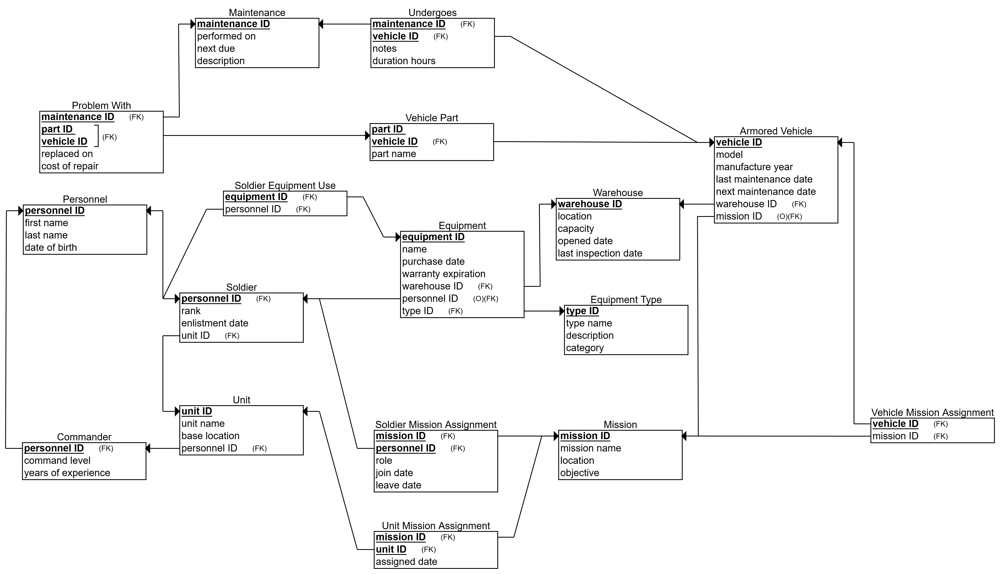

# DBProject_328269121_329114573 


# 🛡️ Armored Warehouse Management System

## 👤 Authors:
- Eliel Monfort - 328269121
- Yehoshua Steinitz - 329114573

---

## 📚 Table of Contents

A. [🏁 Stage 1](#-Stage-1)
  1. [📘 Introduction](#-introduction)
  2. [🗂️ Entities and Attributes](#-entities-and-attributes)
  3. [🔗 Relationships](#-relationships)
  4. [🧠 Design Decisions](#-design-decisions)
  5. [📈 ERD & DSD Diagrams](#-erd--dsd-diagrams)
  6. [📥 Data Insertion Methods](#-data-insertion-methods)
  7. [💾 Backup](#-backup-and-restore)

---
# 🏁 Stage 1

## 📘 Introduction

This project is a **Database Management System** for the **Logistics Unit of the Armored Corps**.

The system is designed to manage all aspects related to **military equipment**, **armored vehicles**, **soldiers**, **commanders**, **missions**, and **vehicle maintenance**.

It stores important data and enables efficient tracking of:

- Equipment stored in warehouses  
- Which soldier or unit is using specific equipment  
- Armored vehicles and their maintenance history  
- Soldiers, commanders, and their assigned units  
- Missions and which units and soldiers are involved  

The goal is to build a smart and organized database that supports real military operations and provides accurate, real-time information for decision-making.

---

## 🗂️ Entities and Attributes

### 1. Warehouse
Represents a storage location for vehicles and equipment.
- `warehouse ID` (PK) : Unique warehouse identifier
- `location` : Physical location
- `capacity` : Storage capacity
- `opened date` : Date the warehouse was opened
- `last inspection_date` : Last inspection date

### 2. Equipment
Represents a piece of equipment.
- `equipment ID` (PK) : Unique equipment identifier
- `name` : Equipment name
- `purchase date` : Date of purchase
- `warranty expiration` : Warranty expiration date

### 3. Equipment Type
Defines categories of equipment.
- `type ID` (PK) : Unique type identifier
- `type name` : Type name
- `category` : General category of the equipment
- `description` : Detailed description

### 4. Armored Vehicle
Represents an armored vehicle.
- `vehicle ID` (PK) : Unique vehicle identifier
- `model` : Vehicle model
- `manufacture year` : Year of manufacture
- `last maintenance date` : Date of last maintenance
- `next maintenance date` : Planned date for next maintenance

### 5. Vehicle Part
Represents a part belonging to a specific vehicle (weak entity).
- `part ID` (Partial PK) : Part identifier
- `part name` : Part name

### 6. Maintenance
Represents maintenance actions.
- `maintenance ID` (PK) : Unique maintenance identifier
- `performed on` : Date maintenance was performed
- `next due` : Date of next scheduled maintenance
- `description` : Description of the maintenance

### 7. Personnel (Superclass)
Represents a person, either a soldier or a commander.
- `personnel ID` (PK) : Unique personnel identifier
- `first name` : First name
- `last name` : Last name
- `date of birth` : Date of birth

### 8. Commander (inherits from `Personnel`)
Subtype of Personnel – represents a commander.
- `command level` : Command level
- `years of experience` : Years of experience

### 9. Soldier (inherits from `Personnel`)
Subtype of Personnel – represents a soldier.
- `rank` : Military rank
- `enlistment date` : Enlistment date

### 10. Unit
Represents a military unit.
- `unit ID` (PK) : Unique unit identifier
- `unit name` : Unit name
- `base location` : Base location

### 11. Mission
Represents a military mission.
- `mission ID` (PK) : Unique mission identifier
- `mission name` : Name of the mission
- `location` : Mission location
- `objective` : Mission objective

---

## 🔗 Relationships

### 1. Contains Equipment
- **Linked Entities:** Equipment ⟷ Warehouse
- **Type:** Many-to-One
- **Explanation:** Equipment is stored in a specific warehouse.

### 2. Categorizes
- **Linked Entities:** Equipment ⟷ Equipment Type
- **Type:** Many-to-One
- **Explanation:** Each equipment item belongs to a defined type, such as weapon, communication device, etc.

### 3. Soldier Equipment Use
- **Linked Entities:** Equipment ⟷ Soldier
- **Type:** Optional Many-to-One
- **Attributes:**
  - `use start` : The date the soldier started using the equipment.
  - `use end` : The date the soldier stopped using the equipment.
- **Explanation:** Equipments may optionally be assigned to a soldier.

### 4. Houses Vehicle
- **Linked Entities:** Armored Vehicle ⟷ Warehouse
- **Type:** Many-to-One
- **Explanation:** Each vehicle is stored in one warehouse, and a warehouse can store many vehicles.

### 5. Undergoes
- **Linked Entities:** Maintenance ⟷ Armored Vehicle
- **Type:** Many-to-Many
- **Attributes:**
  - `notes` : Notes about the maintenance.
  - `duration_hours` : Duration of the maintenance in hours.
- **Explanation:** A maintenance operation may involve several vehicles, each with specific notes and duration.

### 6. Part Of
- **Linked Entities:** Vehicle Part ⟷ Armored Vehicle
- **Type:** Weak Entity Relationship
- **Explanation:** A part belongs to a specific vehicle and cannot exist independently. There can be two identical parts but in two different vehicles.

### 7. Problem With
- **Linked Entities:** Maintenance ⟷ Vehicle Part
- **Type:** Many-to-Many
- - **Attributes:**
  - `Cost of repair` : Repair cost.
  - `replaced on` : Replacement date.
- **Explanation:** Each maintenance action can report issues with multiple parts in one or more vehicles.

### 8. Vehicle Mission Assignment
- **Linked Entities:** Armored Vehicle ⟷ Mission
- **Type:** Optional Many-to-One
- **Explanation:** A vehicle may be assigned to a mission, but it's not mandatory.

### 9. Commander Unit Assignment
- **Linked Entities:** Commander ⟷ Unit
- **Type:** One-to-One
- **Explanation:** Each unit is led by one commander, and a commander leads only one unit.

### 10. Soldier Unit Assignment
- **Linked Entities:** Soldier ⟷ Unit
- **Type:** Many-to-One
- **Explanation:** Each soldier belongs to one unit, while a unit can have many soldiers.

### 11. Soldier Mission Assignment
- **Linked Entities:** Soldier ⟷ Mission
- **Type:** Many-to-Many
- **Attributes:**
  - `role` : Soldier's role during the mission
  - `join date` : Date the soldier joined the mission
  - `leave date` : Date the soldier left the mission
- **Explanation:** Soldiers can be assigned to multiple missions, with additional details such as role and dates.

### 12. Unit Mission Assignment
- **Linked Entities:** Unit ⟷ Mission
- **Type:** Many-to-Many
- **Attributes:**
  - `assigned date` : Date the unit was assigned to the mission
- **Explanation:** Units can participate in multiple missions; each assignment has a specific date.

---

## 🧠 Design Decisions

During the design of the database, we made several design decisions aimed at ensuring **efficiency, flexibility, and accuracy** in data storage and query execution.

### 🔷 1. Inheritance — `Personnel` Table Inheritance

The system includes two types of people:

- **Commander**
- **Soldier**

Both share common attributes such as:
- First Name and Last Name
- ID Number
- Phone Number
- Rank
- Unit

To avoid duplication, we created a single table named `Personnel` that contains all the shared attributes.  
The `Commander` and `Soldier` tables inherit the `personnel_id` from the parent table and add specific fields, such as training type for soldiers.

> 🧠 **Advantage:** This design allows for easy querying of all personnel and specific role tracking without redundant data.

### 🔷 2. Weak Entity — `Vehicle_Part` Table as a Weak Entity

The `Vehicle_Part` table represents the parts of armored vehicles:

- Each part is **directly associated** with only one vehicle (no sharing between vehicles).
- It **cannot exist independently** — it must be associated with an `Armored_Vehicle`.

Therefore, we defined this table as a **weak entity** with a composite primary key:

```sql
PRIMARY KEY (vehicle_id, part_id)
```

> 🧠 **Advantage:** This design makes it easy to track which parts belong to which vehicle without losing the necessary relationship between them.

### 🔷 3. Many-to-Many with Attributes — Complex Relationships with Additional Data

Several many-to-many relationships in the system also store additional information beyond just the relationship:

#### A. `Soldier_Mission_Assignment`

- This table links soldiers to the missions they were assigned to.
- It also includes additional information such as **assignment start date**, **role in the mission**, and **status**.

#### B. `Problem_With`

- This table links **vehicle parts** to the **maintenance tasks** that reported issues with them.
- It includes details such as **repair cost**, **issue severity**, and **replacement date**.

> 🧠 **Advantage:** These relationships not only store the connection but also the **historical context** — when, why, and how the connection happened.

### 🔷 4. Normalization — Data Normalization

We performed **full normalization** (up to higher Normal Forms):

- Each entity is stored in a separate table with a clear primary key.
- Relationships are maintained in join tables with foreign keys.
- Data redundancy is eliminated.
- It is easy to extend the system or modify the structure — **scalability**.

For example:
- The `Equipment_Use` table tracks when a soldier uses an equipment item, without repeating the equipment name.
- The `Commander_Unit_Assignment` table stores the historical assignments of commanders to units.

> 🧠 **Advantage:** The design is easy to maintain, performs quickly, and adheres to the principles of relational database design.

---

## 📈 ERD & DSD Diagrams

- **ERD Diagram**:


- **DSD Diagram**:


---

# 📥 Data Insertion Methods

## Method 1: Mockaroo Data Generation

We used [Mockaroo](https://mockaroo.com) to generate realistic mock data for the following tables:

- `Warehouse`
- `Mission`
- `Personnel`
- `Equipment Type`
- `Maintenance`

The generated data was downloaded as CSV files and then imported using PostgreSQL import tools.

### 📸 Screenshot of Mockaroo configuration:
- **Warehouse Field Definition**


- **Mission Dield Definition**


- **Personnel Field Definition**


- **Equipment Type Field Definition**


- **Maintenance Field Definition**


Mockaroo is a good tool that allows the generation of large volumes of realistic data based on defined field structures. This method was particularly useful for creating the initial dataset quickly and accurately, especially for large tables such as `Warehouse` and `Mission`.

## Method 2: CSV File Insertion

We asked ChatGPT to generate 5 realistic CSV files with 500 rows each for the following tables:

- `Armored Vehicle`
- `Commander`
- `Soldier`
- `Unit`
- `Vehicle Part`

The CSV files were manually reviewed and then inserted into the database using PostgreSQL's CSV import functionality.

📽 Video of the CSV files used:

<!--- the video need to be here --->

The video gives an example of entering data into the `Armored Vehicle` table from a CSV file. This method allowed for efficient bulk data entry and is ideal for populating large tables where specific data structures need to be followed.

By using CSV files, we were able to save time and reduce errors compared to manual data entry. The use of video documentation also helps to demonstrate the process and ensure reproducibility.

---

## Method 3: Python Script

For the second method, I wrote a Python script using `pandas` and `psycopg2` to programmatically insert data into the following tables:

- `Equipment`
- `Problem With`
- `Soldier Equipment Use`
- `Soldier Mission Assignment`
- `Undergoes`
- `Unit Mission Assignment`
- `Vehicle Mission Assignment`

The script facilitated data entry by allowing us to automate the insertion of data into multiple tables, which is especially helpful for large datasets or for performing regular updates to the database.

The Python script works by reading data from predefined sources (such as CSV files or external data), processing it, and executing SQL commands to insert the data into the database.

## ✅ Summary

| Method   | Tables Covered                   | Status     |
|----------|----------------------------------|------------|
| Mockaroo | Warehouse, Mission, Personnel, Equipment Type, Maintenance | ✅ Completed |
| CSV      | Armored Vehicle, Commander, Soldier, Unit, Vehicle Part | ✅ Completed |
| Python   | Equipment, Problem With, Soldier Equipment Use, Soldier Mission Assignment, Undergoes, Unit Mission Assignment, Vehicle Mission Assignment | ✅ Completed |

---

## 💾 Backup

### 📽 Video of the Backup:


<!--- the video need to be here --->

The video demonstrates how we create and restore backups to ensure data is safe and easy to recover when needed.

The backup process helps keep the data safe and ensures it stays intact. Regular backups are important to prevent losing data if something goes wrong with the system. In this project, we used PostgreSQL's built-in tools to create backups.

The backup also allows my partner and me to work on the project at the same time. By using the backup file, we can work on different parts without worrying about messing up the data, making our teamwork smoother.
