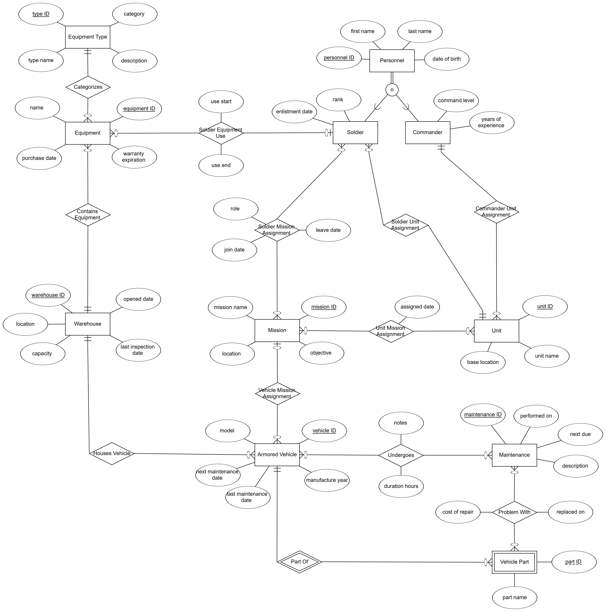

# DBProject_328269121_329114573 


# 🛡️ Armored Corps Logistics Database

## 👤 Authors:
- Eliel Monfort - 328269121
- Yehoshua Steinitz - 329114573

---

## 📚 Table of Contents

A. [🏁 Stage 1](#-Stage-1)
  1. [📘 Introduction](#-introduction)
  2. [🗂️ Entities and Attributes](#entities-and-attributes)
  3. [🔗 Relationships](#-relationships)
  4. [🧠 Design Decisions](#-design-decisions)
  5. [📈 ERD & DSD Diagrams](#-erd--dsd-diagrams)
  6. [📥 Data Insertion Methods](#-data-insertion-methods)
  7. [💾 Backup](#-backup-and-restore)

---
# 🏁 Stage 1

## 📘 Introduction

This project is a database for the **logistics unit of the Armored Corps**.

The system helps manage everything related to military gear, armored vehicles, soldiers, commanders, missions, and vehicle maintenance.

It keeps important information and makes it easy to track things like:

- What equipment is stored in each warehouse  
- Which soldier or unit is using which equipment  
- Armored vehicles and their maintenance records  
- Soldiers and commanders, and which units they belong to  
- Missions and which soldiers and units are taking part  

The goal is to create a clear and well-organized database that helps support real military tasks and gives accurate, up-to-date information for making decisions.

---

## 🗂️ Entities and Attributes

### 1. Warehouse
Represents a storage location for vehicles and equipment.
- `warehouse ID` (PK) : Unique warehouse identifier
- `location` : Physical location
- `capacity` : Storage capacity
- `opened date` : Date the warehouse was opened
- `last inspection_date` : Last inspection date

### 2. Equipment
Represents a piece of equipment.
- `equipment ID` (PK) : Unique equipment identifier
- `name` : Equipment name
- `purchase date` : Date of purchase
- `warranty expiration` : Warranty expiration date

### 3. Equipment Type
Defines categories of equipment.
- `type ID` (PK) : Unique type identifier
- `type name` : Type name
- `category` : General category of the equipment
- `description` : Detailed description

### 4. Armored Vehicle
Represents an armored vehicle.
- `vehicle ID` (PK) : Unique vehicle identifier
- `model` : Vehicle model
- `manufacture year` : Year of manufacture
- `last maintenance date` : Date of last maintenance
- `next maintenance date` : Planned date for next maintenance

### 5. Vehicle Part
Represents a part belonging to a specific vehicle (weak entity).
- `part ID` (Partial PK) : Part identifier
- `part name` : Part name

### 6. Maintenance
Represents maintenance actions.
- `maintenance ID` (PK) : Unique maintenance identifier
- `performed on` : Date maintenance was performed
- `next due` : Date of next scheduled maintenance
- `description` : Description of the maintenance

### 7. Personnel (Superclass)
Represents a person, either a soldier or a commander.
- `personnel ID` (PK) : Unique personnel identifier
- `first name` : First name
- `last name` : Last name
- `date of birth` : Date of birth

### 8. Commander (inherits from `Personnel`)
Subtype of Personnel – represents a commander.
- `command level` : Command level
- `years of experience` : Years of experience

### 9. Soldier (inherits from `Personnel`)
Subtype of Personnel – represents a soldier.
- `rank` : Military rank
- `enlistment date` : Enlistment date

### 10. Unit
Represents a military unit.
- `unit ID` (PK) : Unique unit identifier
- `unit name` : Unit name
- `base location` : Base location

### 11. Mission
Represents a military mission.
- `mission ID` (PK) : Unique mission identifier
- `mission name` : Name of the mission
- `location` : Mission location
- `objective` : Mission objective

---

## 🔗 Relationships

### 1. Contains Equipment
- **Linked Entities:** Equipment ⟷ Warehouse
- **Type:** Many-to-One
- **Explanation:** Equipment is stored in a specific warehouse.

### 2. Categorizes
- **Linked Entities:** Equipment ⟷ Equipment Type
- **Type:** Many-to-One
- **Explanation:** Each equipment item belongs to a defined type, such as weapon, communication device, etc.

### 3. Soldier Equipment Use
- **Linked Entities:** Equipment ⟷ Soldier
- **Type:** Optional Many-to-One
- **Attributes:**
  - `use start` : The date the soldier started using the equipment.
  - `use end` : The date the soldier stopped using the equipment.
- **Explanation:** Equipments may optionally be assigned to a soldier.

### 4. Houses Vehicle
- **Linked Entities:** Armored Vehicle ⟷ Warehouse
- **Type:** Many-to-One
- **Explanation:** Each vehicle is stored in one warehouse, and a warehouse can store many vehicles.

### 5. Undergoes
- **Linked Entities:** Maintenance ⟷ Armored Vehicle
- **Type:** Many-to-Many
- **Attributes:**
  - `notes` : Notes about the maintenance.
  - `duration_hours` : Duration of the maintenance in hours.
- **Explanation:** A maintenance operation may involve several vehicles, each with specific notes and duration.

### 6. Part Of
- **Linked Entities:** Vehicle Part ⟷ Armored Vehicle
- **Type:** Weak Entity Relationship
- **Explanation:** A part belongs to a specific vehicle and cannot exist independently. There can be two identical parts but in two different vehicles.

### 7. Problem With
- **Linked Entities:** Maintenance ⟷ Vehicle Part
- **Type:** Many-to-Many
- - **Attributes:**
  - `Cost of repair` : Repair cost.
  - `replaced on` : Replacement date.
- **Explanation:** Each maintenance action can report issues with multiple parts in one or more vehicles.

### 8. Vehicle Mission Assignment
- **Linked Entities:** Armored Vehicle ⟷ Mission
- **Type:** Optional Many-to-One
- **Explanation:** A vehicle may be assigned to a mission, but it's not mandatory.

### 9. Commander Unit Assignment
- **Linked Entities:** Commander ⟷ Unit
- **Type:** One-to-One
- **Explanation:** Each unit is led by one commander, and a commander leads only one unit.

### 10. Soldier Unit Assignment
- **Linked Entities:** Soldier ⟷ Unit
- **Type:** Many-to-One
- **Explanation:** Each soldier belongs to one unit, while a unit can have many soldiers.

### 11. Soldier Mission Assignment
- **Linked Entities:** Soldier ⟷ Mission
- **Type:** Many-to-Many
- **Attributes:**
  - `role` : Soldier's role during the mission
  - `join date` : Date the soldier joined the mission
  - `leave date` : Date the soldier left the mission
- **Explanation:** Soldiers can be assigned to multiple missions, with additional details such as role and dates.

### 12. Unit Mission Assignment
- **Linked Entities:** Unit ⟷ Mission
- **Type:** Many-to-Many
- **Attributes:**
  - `assigned date` : Date the unit was assigned to the mission
- **Explanation:** Units can participate in multiple missions; each assignment has a specific date.

---

## 🧠 Design Decisions

While designing the database, we made a few key choices to keep it efficient, flexible, and accurate.

### 🔷 1. Inheritance – `Personnel` Table

We have two kinds of people in the system:

- **Commanders**
- **Soldiers**

Since they share some basic details like name, ID, phone number, rank, and unit, we made one main table called `Personnel` to store this shared info.

Then, we created two separate tables – `Commander` and `Soldier` – that use the `personnel_id` from the main table and add fields specific to each role (like training type for soldiers).

> 🧠 **Why it's good:** It avoids repeating the same data and makes it easy to search for any person in the system.

### 🔷 2. Weak Entity – `Vehicle_Part` Table

The `Vehicle_Part` table stores parts that belong to armored vehicles.

- There are identical parts that are belong to different vehicles.
- Each part is linked to just one vehicle.
- A part can't exist on its own – it must be connected to a vehicle.

So we made it a weak entity and gave it a combined primary key:
```sql
PRIMARY KEY (vehicle_id, part_id)
```

> 🧠 **Why it's good:** It clearly shows which part belongs to which vehicle and keeps the link strong between them.

### 🔷 3. Many-to-Many with Extra Info

Some many-to-many relationships in our system need more than just a link – they need extra details.

#### A. `Soldier_Mission_Assignment`

This table connects soldiers to their missions, and includes extra info like:

- When they joined
- What their role was
- Their status during the mission

#### B. `Problem_With`

This one connects vehicle parts to maintenance jobs that found problems with them, and includes:

- Repair cost
- Issue details
- Replacement date

> 🧠 **Why it's good:** These tables keep a full history of what happened, not just who is linked to what.

### 🔷 4. Normalization

We fully normalized the database to higher normal forms:

- Each type of data is in its own table with a clear primary key.
- Connections between tables use foreign keys.
- There’s no repeated data.
- It’s easy to scale or change the structure later.

For example:

- `Equipment_Use` stores when a soldier uses a piece of equipment, without repeating the name.
- `Commander_Unit_Assignment` tracks which commander was assigned to which unit, and when.

> 🧠 **Why it's good:** The system is clean, fast, and easy to update in the future.

---

## 📈 ERD & DSD Diagrams

- **ERD Diagram**:


- **DSD Diagram**:


---

# 📥 Data Insertion Methods

## Method 1: Mockaroo Data Generation

We used [Mockaroo](https://mockaroo.com) to generate realistic mock data for the following tables:

- `Warehouse`
- `Mission`
- `Personnel`
- `Equipment Type`
- `Maintenance`

The generated data was downloaded as CSV files and then imported using PostgreSQL import tools.

### 📸 Screenshot of Mockaroo configurations:
- **Warehouse Field Definitions**


- **Mission Dield Definitions**


- **Personnel Field Definitions**


- **Equipment Type Field Definitions**


- **Maintenance Field Definitions**


Mockaroo is a helpful tool that lets you quickly create large amounts of fake but realistic data, based on the structure you define for each field.  
We used it to build our initial dataset fast and with good accuracy, especially for big tables like `Warehouse` and `Mission`.

## Method 2: CSV File Insertion

We asked ChatGPT to generate 5 realistic CSV files with 500 rows each for the following tables:

- `Armored Vehicle`
- `Commander`
- `Soldier`
- `Unit`
- `Vehicle Part`

The CSV files were manually reviewed and then inserted into the database using PostgreSQL's CSV import functionality.

### 📽 Video of CSV data files import demo:
To download and watch the video click [here](https://github.com/eliel-monfort/DBProject_328269121_329114573/raw/refs/heads/main/Stage_1/DataImportFiles/Video/Inserting_Data_From_CSV_Files_Video.mp4).

The video shows how we added data to the `Armored Vehicle` table using a CSV file. 
This method made it easy to insert a lot of data at once and worked well for large tables that follow a specific format.

Using CSV files helped us save time and avoid mistakes compared to typing the data manually.
The video also helps explain the process clearly and makes it easier to repeat if needed.

---

## Method 3: Python Script

For the third method, we used a Python script with `pandas` and `psycopg2` to insert data into the following tables automatically:
- `Equipment`
- `Problem With`
- `Soldier Equipment Use`
- `Soldier Mission Assignment`
- `Undergoes`
- `Unit Mission Assignment`
- `Vehicle Mission Assignment`

The script made data entry easier by letting us insert data into multiple tables automatically.  
This was especially useful for large datasets or when we needed to update the database regularly.  
It reads data from sources like CSV files, processes it, and runs SQL commands to add the data to the database.

## ✅ Summary

| Method   | Tables Covered                   | Status     |
|----------|----------------------------------|------------|
| Mockaroo | Warehouse, Mission, Personnel, Equipment Type, Maintenance | ✅ Completed |
| CSV      | Armored Vehicle, Commander, Soldier, Unit, Vehicle Part | ✅ Completed |
| Python   | Equipment, Problem With, Soldier Equipment Use, Soldier Mission Assignment, Undergoes, Unit Mission Assignment, Vehicle Mission Assignment | ✅ Completed |

---

## 💾 Backup
### 📽 Video of Backup implementation demo:
To download and watch the video click [here](https://github.com/eliel-monfort/DBProject_328269121_329114573/raw/refs/heads/main/Stage_1/Backup/Video/Backup_Video.mp4).

The video shows how we created and restored backups to keep our data safe and easy to recover.  
We used PostgreSQL’s built-in tools for this. Regular backups are important in case something goes wrong.  
They help make sure the data stays safe and doesn't get lost.

Backups also helped us work on the project as a team.  
By using the backup file, we could work on different parts without messing up each other's work.
