## 📚 Table of Contents

1. [📘 Introduction](#-introduction)
2. [🔁 Reverse Engineering](#-reverse-engineering)
3. [🔗 Integration](#-integration)
4. [🧩 Final Diagrams](#-final-diagrams)
5. [🔎 Views and Queries](#-views-and-queries)
6. [💾 Updated Backup](#-updated-backup)

---

## 📘 Introduction

In this part of the project, we perform **reverse engineering** on another team’s database, and then **integrate** it with our own.

We begin by restoring a backup file, generating the required diagrams (DSD and ERD), and then combining both databases into one unified schema.

---

## 🔁 Reverse Engineering

We were given a backup file from another group. The goal is to analyze its database structure and recreate its schema.

### 🛠 Step 1: DSD Creation

We first created a **new empty database**, and then used the PostgreSQL `restore` feature to upload the backup.

Then we ran the following SQL query for each table to get its column names and data types:

```sql
SELECT 
    column_name, 
    data_type
FROM 
    information_schema.columns
WHERE 
    table_name = 'TableName';
```

This command helped us understand each table’s structure.

📸 **Example: Ammunition table query result**

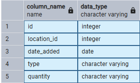

Next, we opened [ERDPlus](https://erdplus.com) and did the following:

1. Created a new diagram.
2. Added a rectangle for each table using the SQL output.
3. Identified the foreign keys and connected the tables with relationships.

This gave us the complete **DSD diagram** for the external system:

📸 **External DSD Diagram**

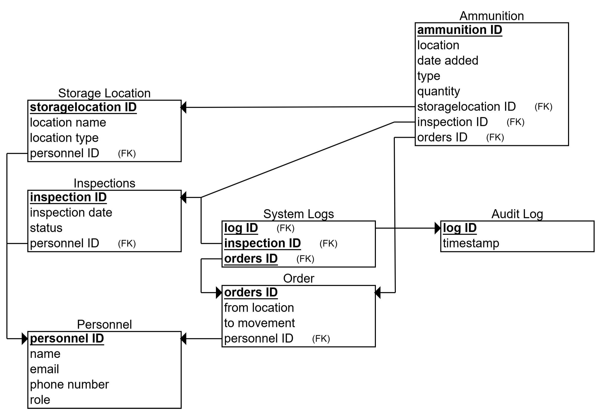

### 🧠 Step 2: ERD Creation

Based on the DSD, we reversed the process and built an **ERD diagram**.

We applied the same logic we learned in our database course: instead of converting an ERD to tables, we did the reverse – we used the tables to reconstruct the ERD.

📸 **External ERD Diagram**

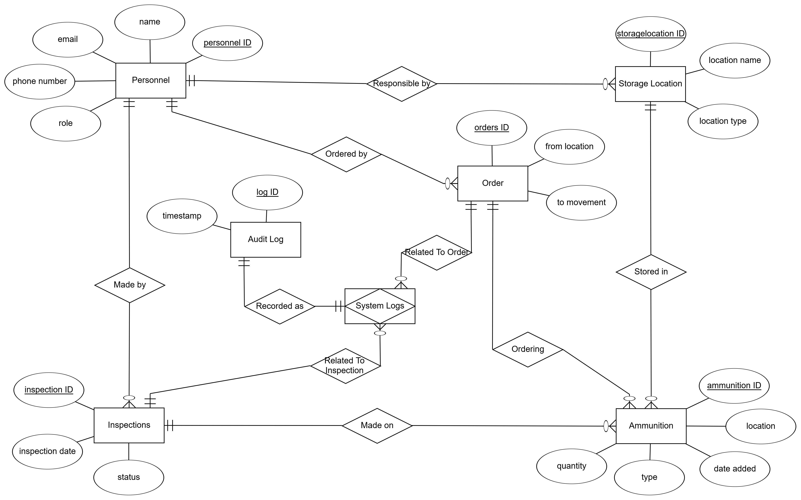

To verify accuracy, we used ERDPlus’s “Convert to Relational Schema” tool to auto-generate a DSD from the ERD we created.

📸 **See button in picture:**

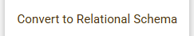

The result matched our manually created DSD, confirming the reverse engineering was successful.

---

## 🔗 Integration

Now we had **two ERD diagrams**:
- One from our system (Stage 1)
- One from the backup system (Stage 3)

The next task was to **merge** them into a single unified database.

We carefully analyzed both ERDs, found overlapping concepts, and designed a shared model.

---

### 🔹 Step 1: Merge `Personnel` Tables
**Goal**: Unify all personal data and avoid duplication.  
**Reasoning**: Both databases have a `Personnel` table. Instead of keeping two separate versions, we decided to merge them.

```sql
ALTER TABLE Personnel
ADD COLUMN email VARCHAR(100),
ADD COLUMN phone_number VARCHAR(20),
ADD COLUMN role VARCHAR(50);
```
**The changes:** We added new columns to the existing `Personnel` table to store contact details and role. This avoids creating a second conflicting `Personnel` table.

---

### 🔹 Step 2: Link `Storage Location` to `Warehouse`
**Goal**: Connect storage location metadata to warehouses, delete `location` attribute and add responsible person for warehouse.  
**Reasoning**: The secondary database has more details about storage locations. By linking it to `Warehouse`, we enrich the warehouse data with more specific location types and responsible personnel.

> **Note:** When I created the new table, I named it `Locations` instead of `Storage Location` - it's just more correct.
> I added `personnel_ID` to Warehouse table to be the manager, and not `Locations` table - it's just more correct too.

```sql
CREATE TABLE Locations (
  location_ID INT PRIMARY KEY,
  location_name VARCHAR(100) NOT NULL,
  location_type VARCHAR(50) NOT NULL,
);

ALTER TABLE Warehouse
DROP COLUMN location;

ALTER TABLE Warehouse
ADD COLUMN location_ID INT,
ADD FOREIGN KEY (location_ID) REFERENCES Locations(location_ID);

ALTER TABLE Warehouse
ADD COLUMN personnel_ID INT,
ADD FOREIGN KEY (personnel_ID) REFERENCES Personnel(personnel_ID);
```
**The changes:** We removed the original `location` column and replaced it with a foreign key to the new `Locations` table. The warehouse manager is now tracked directly.

---

### 🔹 Step 3: Link `Inspections` to `Warehouse`
**Goal**: Track which warehouse each inspection belongs to, and delete `last inspection date` attribute.  
**Reasoning**: Inspections are a critical part of warehouse operations. By connecting inspections to warehouses, we can build a complete history of checks and their results for each facility.

> **Note:** I didn’t include the `personnel_ID` of the inspector, assuming the warehouse manager is responsible for the inspection.

```sql
CREATE TABLE Inspections (
  inspection_ID INT PRIMARY KEY,
  inspection_date DATE NOT NULL,
  status VARCHAR(50) NOT NULL,
  warehouse_ID INT,
  FOREIGN KEY (warehouse_ID) REFERENCES Warehouse(warehouse_ID)
);

ALTER TABLE Warehouse
DROP COLUMN last_inspection_date;
```
**The changes:** We now represent inspections as separate records. The warehouse no longer holds only the last inspection date.

---

### 🔹 Step 4: Link `Orders` to `Mission`
**Goal**: Track logistics movements related to missions.  
**Reasoning**: Orders usually involve moving equipment or goods, often related to missions. By connecting them, we improve mission tracking and logistics management. A new linking table ensures flexibility for many-to-many relationships.

> **Note:** I didn’t include the `personnel_ID` of the Order but added a warehouse ID, assuming the warehouse is responsible for the order.
> I added a `time` attribute to indicate when the order was placed.

```sql
CREATE TABLE Orders (
  orders_ID INT PRIMARY KEY,
  from_location VARCHAR(100) NOT NULL,
  to_movement VARCHAR(100) NOT NULL,
  order_time DATE NOT NULL,
  warehouse_ID INT,
  FOREIGN KEY (warehouse_ID) REFERENCES Warehouse(warehouse_ID);
);

CREATE TABLE Orders_Mission_Assignment (
  orders_ID INT REFERENCES Orders(orders_ID),
  mission_ID INT REFERENCES Mission(mission_ID),
  PRIMARY KEY (orders_ID, mission_ID)
);
```
**The changes:** This structure lets us assign each order to one or more missions and track when it occurred.

---

### 🔹 Step 5: Integrate `Ammunition`
**Goal**: Connect ammunition directly to the warehouse system.  
**Reasoning**: Ammunition is always kept in a specific warehouse, so we only need a direct connection to the Warehouse table. This keeps things simple and clear.

> **Note:** I deleted the column `location` from the table `Ammunition` because the warehouse location is now linked directly using the `warehouse ID` column.

```sql
CREATE TABLE Ammunition (
  ammunition_ID INT PRIMARY KEY,
  date_added DATE NOT NULL,
  type VARCHAR(50) NOT NULL,
  quantity INT NOT NULL,
  warehouse_ID INT,
  FOREIGN KEY (warehouse_ID) REFERENCES Warehouse(warehouse_ID);
);
```
**The changes:** We removed the standalone location and used a direct link to `Warehouse` instead. Each ammo record now includes type, quantity, and date added.

---

### 🔹 Step 6: Use System_Logs in views
**Goal:** Focus on core integration only.
**Reasoning:** We will not connect `System Logs` or `Audit Log` to other tables at this stage.
Instead, we will use them later in the views, where we can display log data as needed.

**The changes:** No changes were made.

---

## 🧩 Final Diagrams

### 📸 Integrated ERD

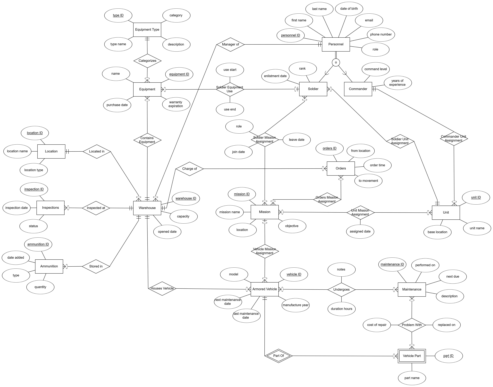

### 📸 Integrated DSD

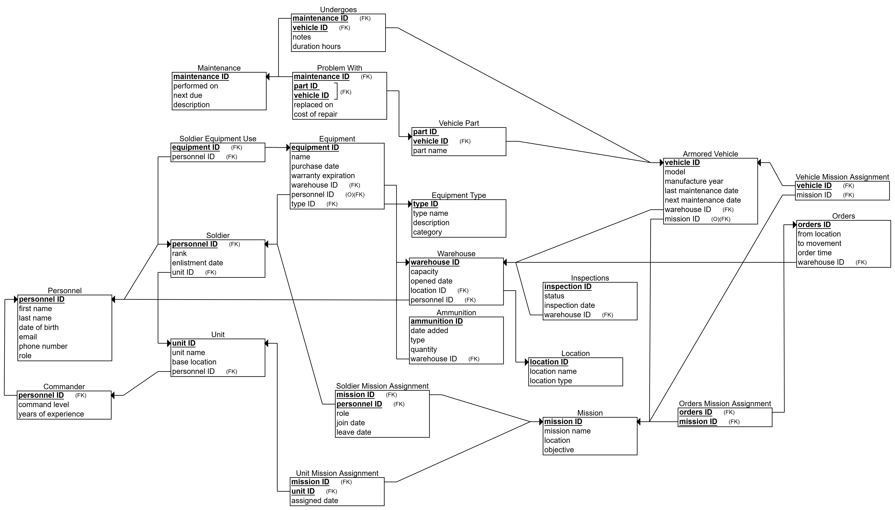

In the background, we executed all the SQL `ALTER` and `INSERT` commands needed to apply the integration.

We filled in the new columns and tables using data from the external backup, along with additional data we generated ourselves.

The result is a fully integrated and updated database with all diagrams and data in sync.

---

## 🔎 Views and Queries

As part of the integration stage, we were required to create **three views**:
- One from the perspective of our original system
- One from the perspective of the external system
- One merged view representing unified system activity

Each view involves multiple tables and provides meaningful insights through additional SQL queries.

---

### 🧭 View 1: Logistics_Equipment_Info (Original System)

This view displays which types of equipment are stored in which warehouses, including the equipment’s name and category.

```sql
CREATE VIEW Logistics_Equipment_Info AS
SELECT
  w.warehouse_ID,
  e.equipment_ID,
  e.name AS equipment_name,
  et.type_name,
  et.category
FROM
  Warehouse w,
  Equipment e,
  Equipment_Type et
WHERE
  e.warehouse_ID = w.warehouse_ID
  AND e.type_ID = et.type_ID;
```

📸 **View Table:** 

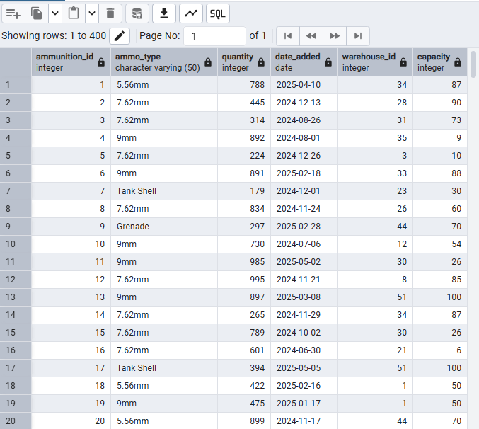

---

#### 🔍 Query 1: Equipment Count per Warehouse by Category

**Purpose:** Show how many different equipment items exist in each warehouse, grouped by category.

```sql
SELECT
  warehouse_ID,
  category,
  COUNT(DISTINCT equipment_ID) AS total_equipment
FROM Logistics_Equipment_Info
GROUP BY warehouse_ID, category
ORDER BY warehouse_ID, total_equipment DESC;
```

📸 **Example Output:**  

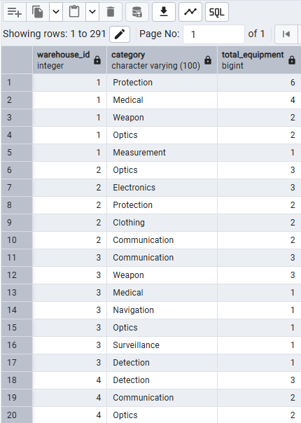

---

#### 🔍 Query 2: Communication Equipment Distribution

**Purpose:** Identify warehouses storing communication equipment. This is useful for checking preparedness for communication-related operations.

```sql
SELECT DISTINCT
  warehouse_ID,
  equipment_name
FROM Logistics_Equipment_Info
WHERE category = 'Communication';
```

📸 **Example Output:**  

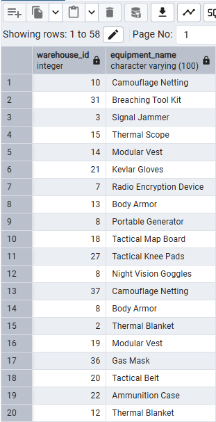

---

### 🧭 View 2: Ammunition_Storage_Info (External System)

This view provides ammunition data across warehouses, showing type, quantity, and storage location details.

```sql
CREATE VIEW Ammunition_Storage_Info AS
SELECT
  a.ammunition_ID,
  a.type AS ammo_type,
  a.quantity,
  a.date_added,
  w.warehouse_ID,
  w.capacity
FROM
  Ammunition a,
  Warehouse w
WHERE
  a.warehouse_ID = w.warehouse_ID;
```

📸 **View Table:** 


---

#### 🔍 Query 1: High Ammunition Stock Warehouses

**Purpose:** Show warehouses with total ammunition quantity greater than 1000.

```sql
SELECT
  warehouse_ID,
  SUM(quantity) AS total_ammo
FROM
  Ammunition_Storage_Info
GROUP BY
  warehouse_ID
HAVING
  SUM(quantity) > 1000;
```

📸 **Example Output:**  

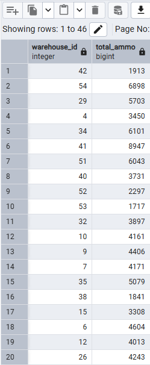

---

#### 🔍 Query 2: Ammunition in Largest Warehouse

**Purpose:** Show ammunition types and amounts stored in the warehouse with the highest capacity.

```sql
SELECT
  ammo_type,
  quantity
FROM
  Ammunition_Storage_Info
WHERE
  warehouse_ID = (
    SELECT warehouse_ID
    FROM Warehouse
    ORDER BY capacity DESC
    LIMIT 1
  );
```

📸 **Example Output:**  

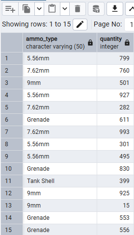

---

### 🧭 View 3: System_Activity_Log (Merged View)

This view combines inspections, orders, and maintenance actions into a single activity log — like a computer log that helps track every action taken in the system.


```sql
CREATE VIEW System_Activity_Log AS

-- Inspections
SELECT
  inspection_ID AS action_id,
  'Inspection' AS action_type,
  inspection_date AS action_date,
  status AS action_details
FROM Inspections

UNION ALL

-- Orders
SELECT
  orders_ID AS action_id,
  'Order' AS action_type,
  order_time::DATE AS action_date,
  CONCAT('Moved from ', from_location, ' to ', to_movement) AS action_details
FROM Orders

UNION ALL

-- Maintenance
SELECT
  maintenance_ID AS action_id,
  'Maintenance' AS action_type,
  performed_on AS action_date,
  description AS action_details
FROM Maintenance;
```

📸 **View Table:**  

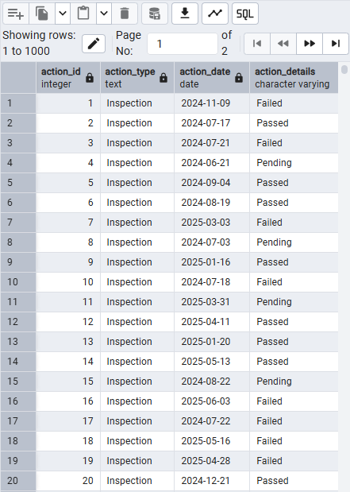

---

#### 🔍 Query 1: Recent Activities

**Purpose:** Show all system actions performed after June 1st, 2025.

```sql
SELECT *
FROM System_Activity_Log
WHERE action_date > '2025-06-01';
```

📸 **Example Output:** 

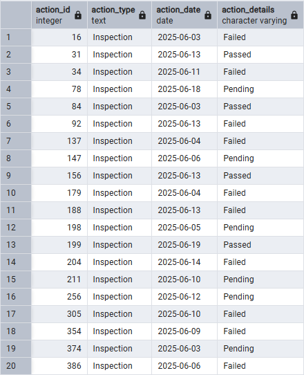

---

#### 🔍 Query 2: Count by Activity Type

**Purpose:** Show how many actions of each type were logged in the system.

```sql
SELECT action_type, COUNT(*) AS total
FROM System_Activity_Log
GROUP BY action_type;
```

📸 **Example Output:**  
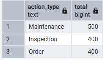

---

## 💾 Updated Backup

During this stage, we performed multiple updates and inserts into the database. To preserve the current state and ensure data consistency, we now create a full **third** backup.