## 📚 Table of Contents

1. [📘 Introduction](#-introduction)
2. [📊 Function: get_warehouses_status](#-function-get_warehouses_status)
3. [📊 Function: get_mission_preparedness](#-function-get_mission_preparedness)
4. [🔧 Procedure: transfer_warehouse_entity](#-procedure-transfer_warehouse_entity)
5. [🔧 Procedure: manage_mission_operations](#-procedure-manage_mission_operations)
6. [🔒 Trigger: log_warehouse_entity_transfer](#-trigger-log_warehouse_entity_transfer)
7. [🔒 Trigger: trg_prevent_assign_not_ready_vehicle](#-trigger-trg_prevent_assign_not_ready_vehicle)
8. [🔢 Main Program 1: Warehouse Management System](#-main-program-1-warehouse-management-system)
9. [🔢 Main Program 2: Mission Management System](#-main-program-2-mission-management-system)
10. [💾 Updated Backup](#-updated-backup)

---

## 📘 Introduction

In this stage of the project, we implemented several PL/pgSQL programs to extend the functionality of our integrated database system. This includes:

- 2 functions
- 2 procedures
- 2 triggers
- 2 main SQL programs

The goal was to cover advanced PL/pgSQL programming features such as cursors, exceptions, DML operations, and multi-entity logic.

---

## 📊 Function: get_warehouses_status

### **Description**

**Purpose:**  
Provides a dashboard report about all warehouses, showing their usage, remaining space, and alerts if they are full or almost full.

**Main Features:**  
- For each warehouse, the function calculates and displays:
  - Whether the warehouse is full or almost full, with clear alert messages
  - The name of the warehouse manager and the warehouse location
  - The total storage capacity, how much space is used, and how much space is left
  - The total number of vehicles, equipment items, and ammunition units stored
- The function gathers and combines information from several tables:
  (warehouse, locations, personnel, equipment, ammunition, and armored_vehicle)
- The results are returned as a refcursor, allowing you to easily use or display the report in different ways

### SQL Code:

```sql
-- Full code from get_warehouses_status.sql included here
```

### 📸 Execution Proof

Shows a clear report with values such as warehouse capacity, used space, remaining space, and total items:

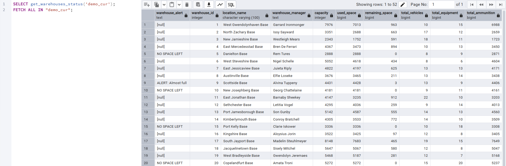

---

## 📊 Function: get_mission_preparedness

### **Description**

**Purpose:**  
Generates a report about how prepared each mission/unit is, based on vehicles and soldiers.

**Main Features:**  
- For each mission and unit the function:
  - Counts assigned vehicles and soldiers
  - Checks how many vehicles are ready (maintenance is valid)
  - Returns mission status ("Ready" or "Not Ready") and a comment
- Allows setting a minimum number of ready vehicles for readiness
- Returns the result as a refcursor

### SQL Code:

```sql
-- Full code from get_mission_preparedness.sql included here
```

### 📸 Execution Proof

Output shows mission names, units, readiness status and comments:

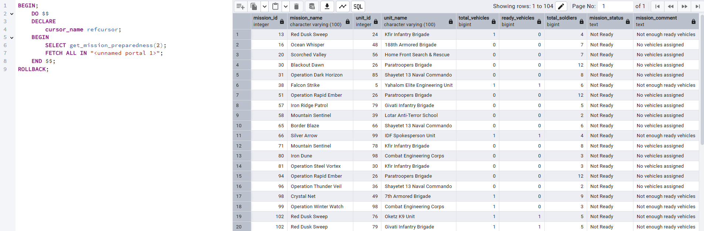

---

## 🔧 Procedure: transfer_warehouse_entity

### **Description**

**Purpose:**  
Transfers an entity (equipment, ammunition, armored vehicle, or vehicle part) from one warehouse to another, with full validation.

**Main Features:**  
- Supports transferring different types of entities:
  - Equipment
  - Ammunition
  - Armored vehicle
  - Vehicle part (by moving its vehicle)
- Checks that the target warehouse has enough capacity
- Validates that the entity exists in the source warehouse
- Prevents duplicate ammunition in the target warehouse
- For vehicle parts, checks that the part and vehicle match and are in the source warehouse
- Raises clear error messages if something is wrong (no space, not found, etc.)
- Uses robust error handling for data safety

**Actions:**  
- `'equipment'` - Moves a specific equipment item.
- `'ammunition'` - Moves a specific ammunition item, but only if it does not already exist in the target warehouse.
- `'armored_vehicle'` - Moves a specific armored vehicle.
- `'vehicle_part'` - Moves the entire vehicle that contains the specified part.

### SQL Code:

```sql
-- Full code from transfer_warehouse_entity.sql included here
```

### 📸 Execution Proof

**Before**:

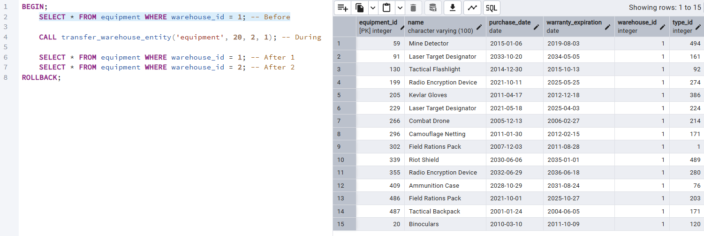

**During (with NOTICE message)**:

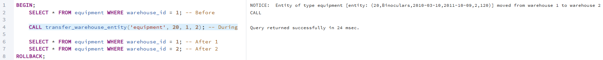

**After (Updated locations)**:

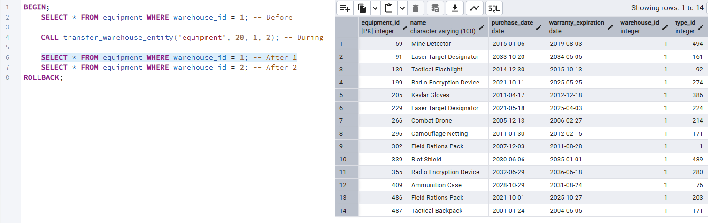

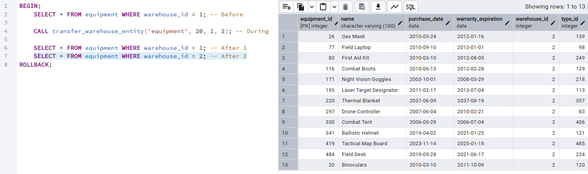

---

## 🔧 Procedure: manage_mission_operations

### **Description**

**Purpose:**  
Handles different mission-related operations for vehicles and soldiers.

**Main Features:**  
- Multi-action procedure, controlled by the `p_action` parameter.
- Uses explicit and implicit cursors for advanced logic
- Handles unique constraint and other errors
- Gives user-friendly feedback with NOTICE and WARNING messages
- Uses a temporary table for summary reports

**Actions:**  
- `'assign_vehicle'` - Assigns a vehicle to a mission (if not already assigned).
- `'remove_vehicle'` - Removes a vehicle from a mission.
- `'replace_vehicle'` - Finds a not-ready vehicle in a mission and replaces it with an available, ready vehicle.
- `'move_soldier'` - Moves a soldier to a different unit (requires soldier ID and new unit ID).
- `'summary'` - Generates a summary report for a mission and unit, showing mission name, unit name, number of vehicles, ready vehicles, and soldiers.

### SQL Code:

```sql
-- Full code from manage_mission_operations.sql included here
```

### 📸 Execution Proof

**Assign Vehicle (Success)**:

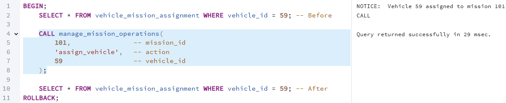

**Assign Vehicle - Before**:

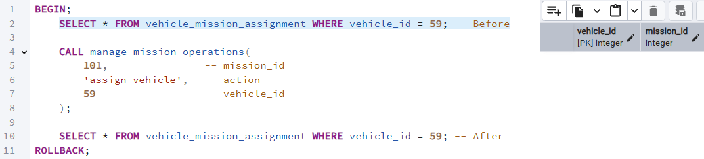

**Assign Vehicle - After**:

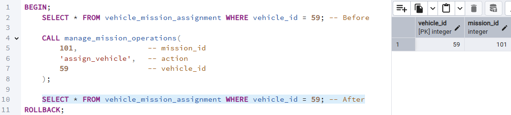

**Duplicate Assignment Exception**:

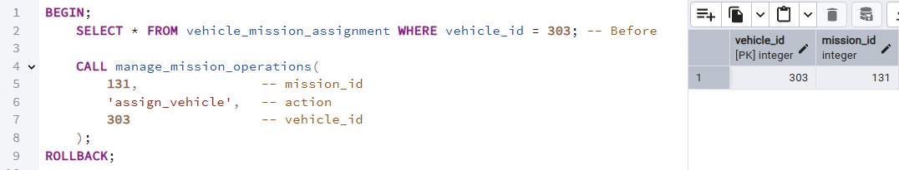

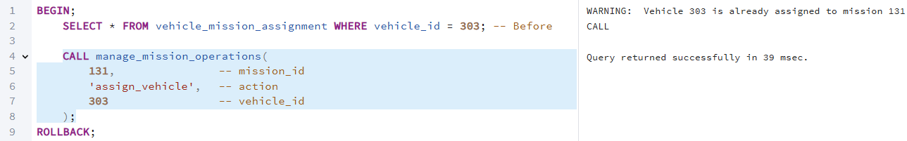

---

## 🔒 Trigger: log_warehouse_entity_transfer

### **Description**

**Purpose:**  
Logs any transfer (warehouse change) of equipment, ammunition, or armored vehicles.

**Main Features:**  
- Works automatically after updating the warehouse ID in equipment, ammunition, or armored_vehicle tables
- Checks if logging is enabled (using a session variable)
- Prints a NOTICE message with details of the transfer (entity type, ID, source and target warehouse)
- Helps track and audit inventory movements

### SQL Code:

```sql
-- Full code from Trigger1.sql included here
```

### 📸 Execution Proof

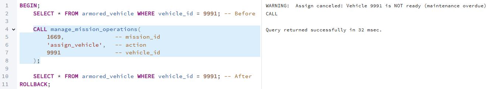

---

## 🔒 Trigger: trg_prevent_assign_not_ready_vehicle

### **Description**

**Purpose:**  
Prevents assigning a vehicle to a mission if the vehicle is not ready (maintenance overdue).

**Main Features:**  
- Runs automatically before inserting a new vehicle-mission assignment
- Checks if the vehicle's next maintenance date is in the future
- If not ready, cancels the assignment and raises a WARNING message
- Ensures only ready vehicles are assigned to missions

### SQL Code:

```sql
-- Full code from Trigger2.sql included here
```

### 📸 Execution Proof

**Trigger Output**:

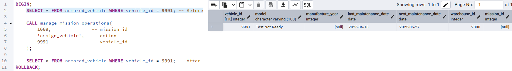

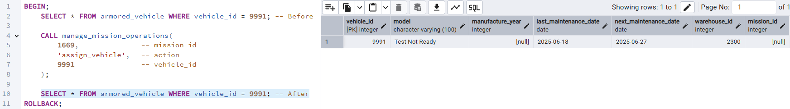

---

## 🔢 Main Program 1: Warehouse Management System

### **Description**

Demonstrates the use of warehouse status report and multiple transfer operations (equipment, ammunition, vehicle, and part). Printed results show before and after warehouse conditions.

### SQL Code:

```sql
-- Full code from MainFunction1.sql included here
```

---

## 🔢 Main Program 2: Mission Management System

### **Description**

Executes full mission management flow: generate reports, assign/replace vehicles, move soldier, show summary, and handle exception with duplicate assignment.

### SQL Code:

```sql
-- Full code from MainFunction2.sql included here
```

---

## 💾 Updated Backup

A new backup named **ACLD_Backup_3** was created after successful testing of all programs.
